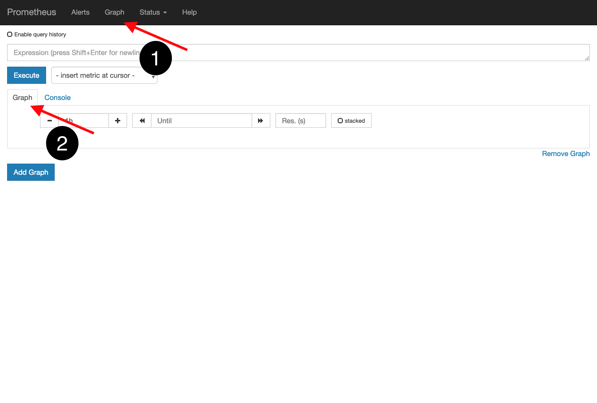

# OCP 4 Image Mangement - Demos

## Registry configuration and common options

To view the operator configuration, use the command `oc get -o yaml configs.imageregistry.operator.openshift.io/instance -n openshift-image-registry`.

```
you@bastion ~]$ oc get -o yaml configs.imageregistry.operator.openshift.io/instance -n openshift-image-registry
apiVersion: imageregistry.operator.openshift.io/v1
kind: Config
metadata:
    [...]
spec:
    httpSecret: 20cb9a6ffNotAvaLIdSecREt3978cc6ec806e
    logging: 2
    managementState: Managed
    proxy: {}
    replicas: 1
    requests:
    read: {}
    write: {}
    storage:
    s3:
        bucket: image-registry--babcd3c9183b44a1aa1c24ff8c9e53f3-564e780d33981
        region: us-east-1
status:
    conditions:
    - lastTransitionTime: 2019-02-18T16:16:00Z
    message: Deployment has minimum availability
    status: "True"
    type: Available
    [...]
    generations: null
    internalRegistryHostname: image-registry.openshift-image-registry.svc:5000
    observedGeneration: 1
    readyReplicas: 0
    storage:
    s3:
        bucket: image-registry--babcd3c9183b44a1aa1c24ff8c9e53f3-564e780d33981
        region: us-east-1
    storageManaged: true
    version: ""
```

The data in the `spec` section contains configuration information which has been added by the operator or administrator during the course of deployment and/or execution.

The data in the `status` section reflects the current status of the registry.  This includes status condition changes, the number of replicas which exist, the type of storage being used and it's real-time configuration.

Some interesting highlights of the configuration include:

* `spec.logging` - Set to a value from `0` (lowest) to `3` (highest) to indicate how verbose the logs should be.
* `spec.replicas` - The number of replicas which should be deployed.
* `spec.storage.s3` - Allows the customization of certain aspects of the S3 bucket and storage properties being used.  **S3 is currently the only supported storage type.**

## Accessing the registry externally

The image registry operator does not create a route by default.  The registry is accessible internally using the service name `image-registry` on the standard port `5000`.  There are two options for enabling access to the registry from outside the OpenShift cluster:

1. Create the default route
   
   When specified, the operator will create a default route for the registry with the name `default-route-openshift-image-registry.<domain name>`.  To request this route be created, edit the configuration using the below command:

   ```
   oc patch configs.imageregistry.operator.openshift.io/instance -n openshift-image-registry --type merge --patch '{ "spec": { "defaultRoute": true } }'
   ```
   
   After modifying the operator configuration, the route is created:
   
   ```
   [you@bastion ~]$ oc get route -n openshift-image-registry
   NAME            HOST/PORT                                                                        PATH   SERVICES         PORT    TERMINATION   WILDCARD
   default-route   default-route-openshift-image-registry.apps.cluster-a407.a407.ocp4.opentlc.com          image-registry   <all>   reencrypt        None
   ```
   
1. Create one or more routes defined by the administrator
   
   If you want to use custom route names, you can provide one or more as a part of the configuration as well.  To create non-default routes, we need to supply three pieces of data:
   
   * A name
   * The hostname desired
   * A secret with the certificate information
     
     The secret must have three items in it: the certificate, the key, and the CA certificate.
     
     ```
     apiVersion: v1
     kind: Secret
     metadata:
       name: route-certificate
       namespace: openshift-image-registry
     data:
       tls.crt: <certificate>
       tls.key: <key>
       tls.cacrt: <ca_certificate>
     type: Opaque
     ```
     
   Once the secret has been created, modifying the configuration can be done via patch:
   
   ```
   oc patch configs.imageregistry.operator.openshift.io/instance -n openshift-image-registry --type merge --patch '
     {
       "spec": {
          "routes": [
             {
               "name": "registry",
               "hostname": "registry.yourdomain.tld",
               "secret": "route-certificate"
             }
           ]
        }
     }'
   ```

   Here is the result of the route being created:
   
   ```
   [you@bastion ~]$ oc get route
   NAME            HOST/PORT                                                                        PATH   SERVICES         PORT    TERMINATION   WILDCARD
   registry        registry.apps.cluster-a407.a407.ocp4.opentlc.com                                        image-registry   <all>   reencrypt     None
   ```

## Registry metrics

Metrics are configured to be collected by the operator and accessible from the Prometheus endpoint of your OpenShift cluster.  To view the Prometheus dashboard, you can click the link at `Monitoring -> Metrics` or retrieve the route using the command `oc get route prometheus-k8s -n openshift-monitoring`.  Using Prometheus' native interface, we can create simple charts to view the status.  You will want to use Grafana to create more robust dashboards for monitoring the state and health of your registry deployment in a production environment.

In the Promethus UI, select the "Graph" option at the top, and again in the ensuing sub-tab.



From here, we can find the metrics which pertain to the image registry.  All of the metrics are in the Prometheus' namespace `imagemetrics`, so if we begin typing that value into the box, the avaialble metrics will be shown:


Select a metric, in this case we've used `imageregistry_http_request_duration_seconds`, then press the "Execute" button.  The result will be a graph showing the last hour's worth of values for that metric.


**Note:** The image above represents an image registry deployment where the number of replicas is three, hence three lines.